# Handbuch für Vorstände

Dieses Handbuch führt durch die Einrichtung und laufende Verwaltung einer Courtside-Instanz. Die
Namen von Menüpunkten und Schaltflächen stehen *kursiv*. Öffnungszeiten, Fristen und Obergrenzen
bestimmt jeder Verein selbst.

## Wer die Verwaltung sieht

Nur aktive Konten mit der Rolle **Administrator** können die Verwaltung öffnen. Für diese Konten
erscheint *Verwaltung* in der Hauptnavigation. Andere Konten erhalten auch über eine direkt
eingegebene Adresse keinen Zugriff.

Die Seitenleiste ordnet die Verwaltung in vier Bereiche:

| Bereich | Inhalt |
|---|---|
| **Verein** | Einrichtung und Konfiguration |
| **Anlage** | Plätze, Öffnungszeiten, Buchungskarten und Platzfüller |
| **Mitglieder** | Personen, Konten, Mitgliedsarten und Import |
| **Nachweise** | Auslastung, Datenexport, Änderungsprotokoll und Nachrichtenprotokoll |

Über dieselbe Leiste kehrst du zum Platzplan zurück.

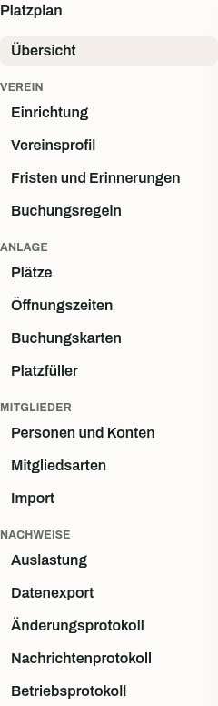

## Der geführte Weg: Einrichtung

Öffne *Verein → Einrichtung*. Die Übersicht prüft den aktuellen Stand und kennzeichnet jeden
Schritt als abgeschlossen, offen oder optional.

Arbeite die Schritte in dieser Reihenfolge ab:

1. **Verein konfigurieren.** Hinterlege Name, Farben, Logo, Sprache, Zeitzone und
   Kontoeinstellungen.
2. **Anlage vorbereiten.** Lege mindestens einen aktiven Platz und einen geöffneten Wochentag
   an.
3. **Mitgliedsarten anbieten.** Verbinde Mitgliedsarten mit Buchungsregeln und Kontorechten.
4. **Mitglieder aufnehmen.** Erfasse mindestens eine laufende Mitgliedschaft.
5. **Mitglieder importieren.** Dieser Schritt ist nur nötig, wenn eine andere
   Mitgliederverwaltung die führende Liste enthält.

Du kannst die Übersicht jederzeit verlassen. Beim nächsten Öffnen ermittelt Courtside den Stand
neu.

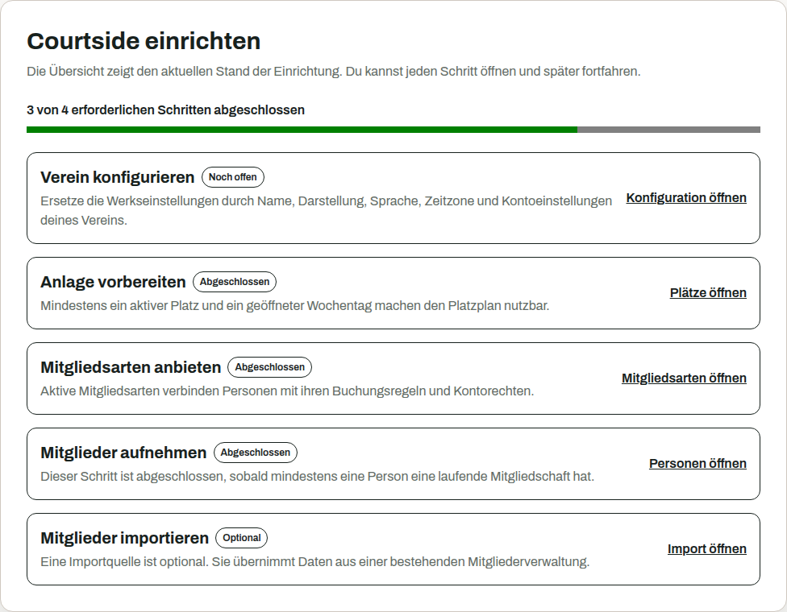

## Verein → Konfiguration

Öffne *Verein → Konfiguration* und bearbeite die Einstellungen für die gesamte Instanz.

### Verein und Darstellung

Trage Vereinsname, Primärfarbe, Akzentfarbe und Logo ein. Courtside zeigt für jede Farbe den
Kontrast zu hellem und dunklem Text. Für normalen Text gilt ein Verhältnis von mindestens 4,5 zu 1.

Logos müssen als PNG oder JPEG vorliegen. Die Datei darf höchstens 1 MiB groß sein und 2048 mal
2048 Pixel messen. Eine hochgeladene Datei ersetzt die Logo-URL, bis du die Datei entfernst.

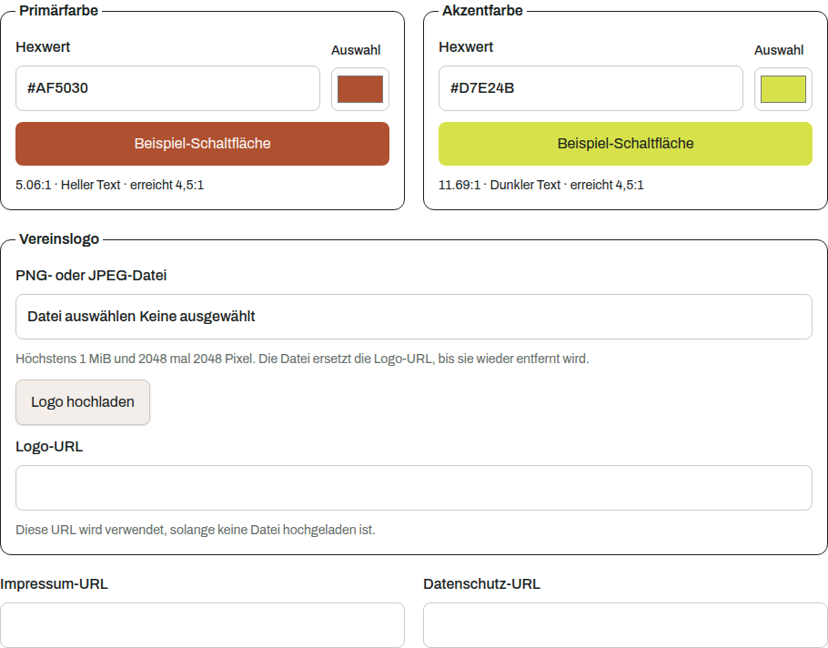

### Links, Sprache und Zeit

* Hinterlege unter **Impressum** und **Datenschutz** die Seiten des Vereins.
* Unter **Dokumentation** kannst du eine eigene Anleitung verlinken. Bleibt das Feld leer,
  führt der Link in der Fußzeile zur Courtside-Dokumentation. Der Link ist immer sichtbar, und
  die eingetragene Adresse ist wie Impressum und Datenschutz ohne Anmeldung abrufbar. Trage dort
  also nichts ein, das nicht jeder sehen soll.
* Die **Standardsprache** gilt für Personen ohne eigene Sprachauswahl.
* Gib eine gültige IANA-Zeitzone ein, zum Beispiel `Europe/Berlin`. Du kannst die Zeitzone
  nur ändern, solange keine zukünftige Buchung vorhanden ist.
* Das **Buchungsraster** bestimmt die Zeilen im Platzplan und die zulässigen Startzeiten.

### Nachrichten und Zugangsdaten

* Der Wert 0 bei **Erinnerung vor einer Buchung** schaltet Erinnerungen aus. Ein anderer Wert legt
  den Abstand in Stunden fest.
* Stelle getrennt ein, wie lange Einmalpasswörter für neue und zurückgesetzte Konten gelten.
* Der Code zum Zurücksetzen darf zwischen 15 Minuten und einem Tag gültig sein. Nach Ablauf muss das
  Mitglied einen neuen Code anfordern.

### Personen ohne Mitgliedsart

Wähle ein Regelwerk für Personen ohne aktuelle Mitgliedsart, wenn auch für diese Gruppe
mitgliedschaftsbezogene Regeln gelten sollen. Ohne Auswahl gelten weiterhin Öffnungszeiten und
Buchungsraster.

## Anlage → Plätze

Ein Platz braucht eine eindeutige Nummer und einen Namen. Beides kannst du später ändern.

Deaktiviere einen Platz, den der Verein nicht mehr nutzt. Der Platz verschwindet aus dem
Platzplan, bleibt aber in vergangenen Buchungen und Auswertungen erhalten. Courtside benachrichtigt
Mitglieder mit betroffenen zukünftigen Buchungen.

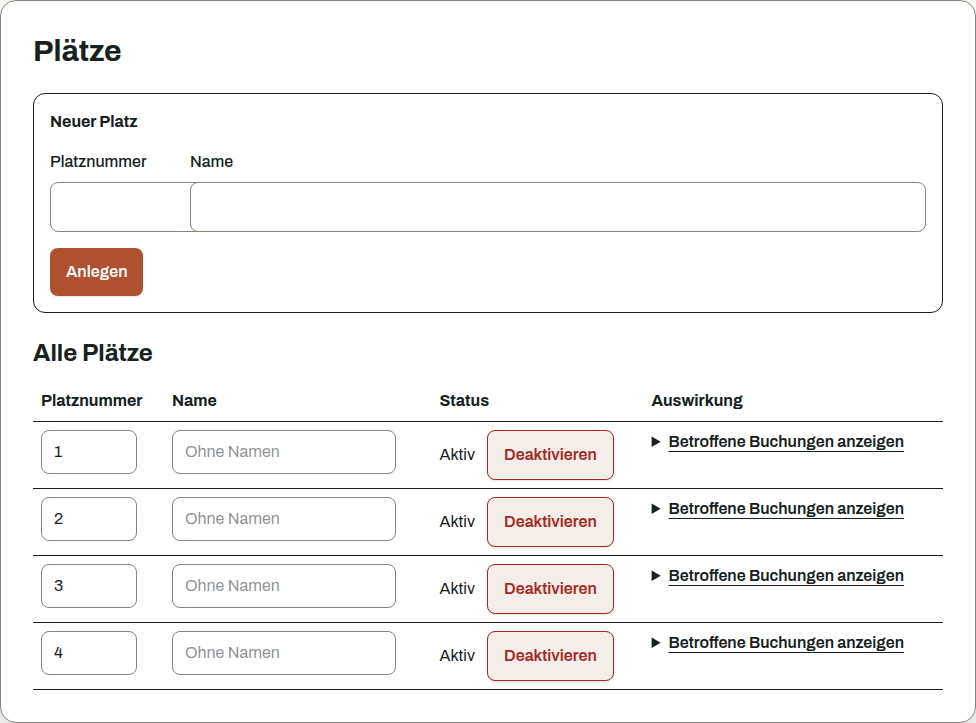

## Anlage → Öffnungszeiten

1. Trage für jeden geöffneten Wochentag eine Öffnungs- und eine Schließzeit ein.
2. Markiere Tage ohne Spielbetrieb als geschlossen.
3. Nutze *Gleiche Zeiten übernehmen*, um ein Zeitfenster auf mehrere Tage anzuwenden.
4. Speichere die gesamte Woche.

Courtside speichert keinen Tag, bei dem eine der beiden Zeiten fehlt. Außerhalb der Öffnungszeiten
sind keine Buchungen möglich. Wenn du Öffnungszeiten später verkürzt, benachrichtigt Courtside
die Mitglieder mit betroffenen Buchungen.

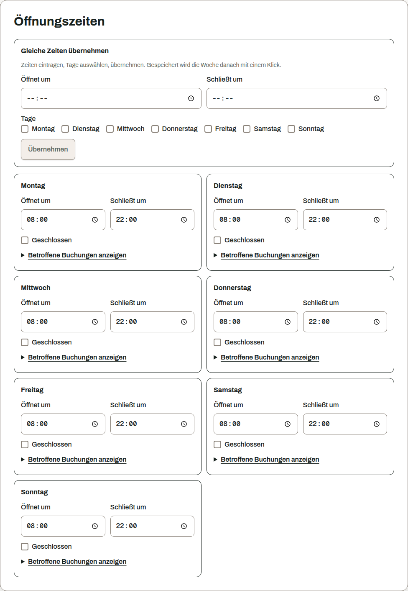

## Anlage → Buchungskarten

Buchungskarten unterscheiden die Arten einer Platzbelegung, etwa Mitgliederspiel, Training,
Punktspiel oder Sperrung. Lege für jede benötigte Art eine Karte an.

| Einstellung | Wirkung |
|---|---|
| **Bezeichnung und Farbe** | Darstellung im Platzplan. Courtside zeigt den Kontrast der Beschriftung zur Farbe und warnt unter 4,5 zu 1 |
| **Berechtigte Rollen** | Rollen, die mit der Karte buchen dürfen. Ohne Auswahl dürfen alle angemeldeten Personen buchen |
| **Verantwortliche Rollen** | Rollen, die jede Buchung dieser Karte öffnen, einsehen und stornieren dürfen |
| **Erlaubte Spielerzahlen** | Zulässige Zahl von Teilnehmenden. Ohne Wert erfasst die Karte keine Teilnehmenden |
| **Zählt gegen Buchungslimits** | Rechnet die Buchung auf die Obergrenze offener Buchungen an |
| **Gäste erlaubt** | Erlaubt namentlich erfasste Gäste |
| **Neutral anzeigen** | Zeigt im öffentlichen Platzplan *Belegt* statt der Kartenbezeichnung |

Administratoren dürfen jede Karte verwenden und verwalten. Eine neutrale Anzeige schützt die
Bezeichnung nicht vor technischem Zugriff, da die öffentliche Schnittstelle sie weiterhin liefert.
Verwende deshalb keine vertraulichen Bezeichnungen.

Deaktiviere nicht mehr benötigte Karten. Bestehende Buchungen bleiben erhalten.

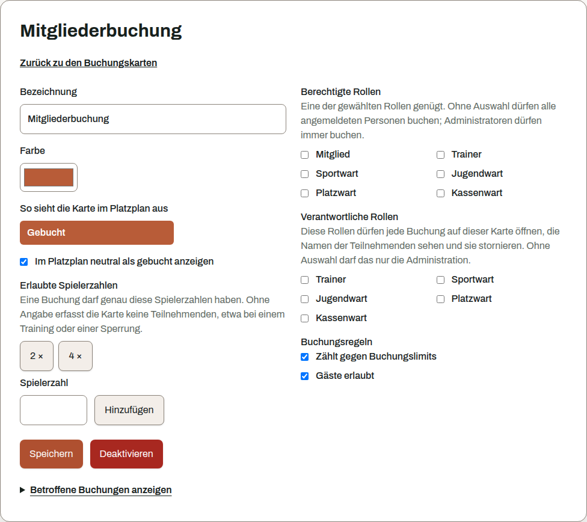

## Anlage → Platzfüller

Platzfüller belegen einen Spielerplatz, ohne eine Person zu sein. Beispiele sind eine Ballmaschine
oder der Eintrag "Spielpartner gesucht".

Gib eine Bezeichnung und optional die verfügbare Anzahl ein. Ein leeres Anzahlfeld erlaubt
beliebig viele gleichzeitige Verwendungen. Ist die begrenzte Anzahl belegt, lehnt Courtside weitere
Auswahlen für denselben Zeitraum ab.

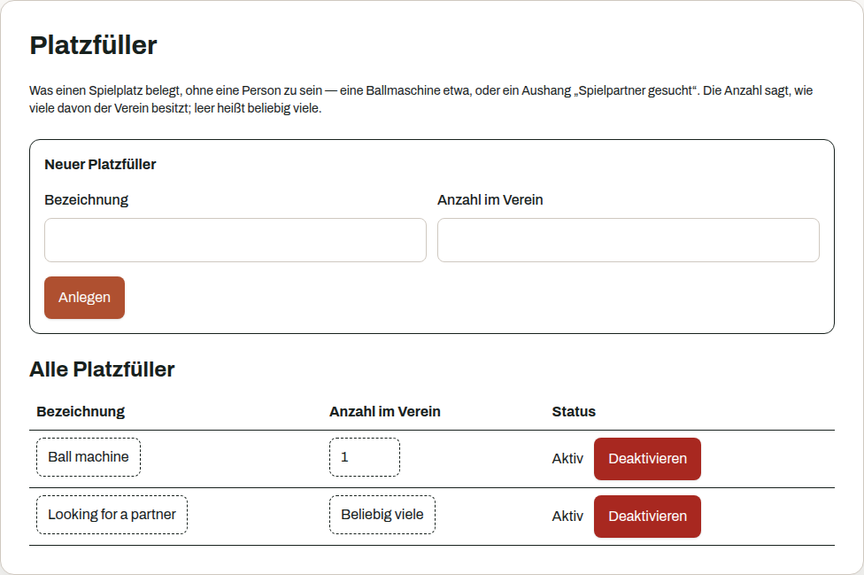

## Buchungsregeln

Öffne die Buchungsregeln unter *Verein → Konfiguration*. Eine Mitgliedsart verweist auf ein
Regelwerk. Jedes Regelwerk kann diese Regeln höchstens einmal enthalten:

| Regel | Einstellung |
|---|---|
| Buchungsvorlauf | Höchste Zahl von Tagen im Voraus |
| Offene Buchungen | Höchste Zahl gleichzeitig offener Buchungen |
| Maximale Buchungsdauer | Höchste Dauer in Minuten |
| Stornierungsfrist | Mindestabstand zur Buchung in Minuten |
| Buchen gesperrt | Verbietet Mitgliedern das Buchen und Verschieben ohne weitere Einstellung |

Öffnungszeiten und Buchungsraster gelten für den ganzen Verein. Sie stehen deshalb außerhalb der
Regelwerke. Administratoren können das Buchungsverbot für Verwaltungsaufgaben übergehen. Das
Zeit- und Platzraster gilt auch für sie.

Beim Stilllegen bleibt ein Regelwerk für bereits zugeordnete Mitgliedsarten wirksam. Es steht nur
nicht mehr für neue Zuordnungen bereit. Weise den betroffenen Mitgliedsarten zuerst ein anderes
Regelwerk zu, wenn sich ihre Regeln ändern sollen.

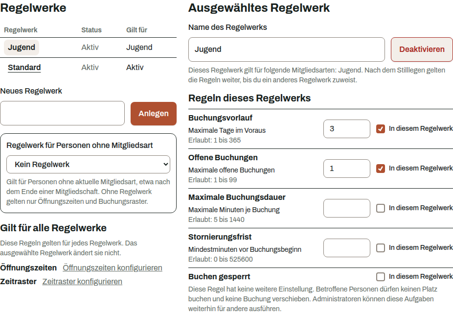

## Mitglieder → Mitgliedsarten

Eine Mitgliedsart hat eine Bezeichnung, ein Regelwerk und eine Einstellung für den Import. Die
Übersicht zeigt jede Art in einer Zeile, am Handy als eigene Karte, sodass du die Regelwerke
aller Arten untereinander vergleichst. *Regeln bearbeiten* öffnet genau das Regelwerk der Art.

Aktiviere **Zugang beim Import anlegen**, wenn importierte Mitglieder dieser Art automatisch
ein Konto erhalten sollen. Courtside sendet das Einmalpasswort an die hinterlegte E-Mail-Adresse.
Bestehende Konten bleiben unverändert.

Beim Stilllegen bleiben bestehende Zuordnungen und deren Buchungsregeln erhalten. Die Mitgliedsart
kann danach nicht mehr neu vergeben werden.

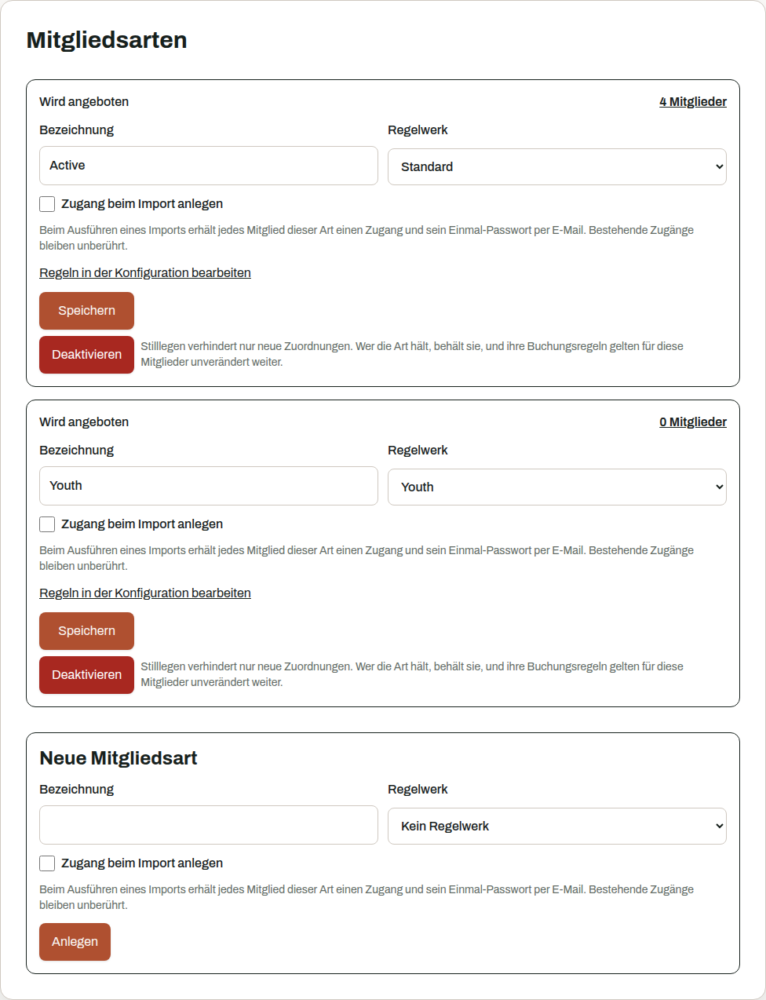

## Mitglieder → Personen und Konten

Oben legst du eine neue Person an. Darunter zeigt die Übersicht Name, Benutzername, Kontostatus,
Zugang, Mitgliedsart und Rollen, dazu die Zahl der Personen, auf die Suche und Filter passen. Ein
gesperrtes Konto ist farbig und mit eigenem Zeichen markiert. Die Spalte Zugang sagt, ob Zugangsdaten
noch nicht ausgestellt, ausgestellt oder abgelaufen sind oder ob das Mitglied ein eigenes Passwort
gewählt hat. Der Filter **Zugang** mit **Noch kein eigenes Passwort** listet alle, die noch kein
eigenes Passwort gewählt haben. Auf dem Smartphone sortierst du über **Sortieren nach** und **Reihenfolge**.
Vorname, Nachname und E-Mail-Adresse kannst du später korrigieren.

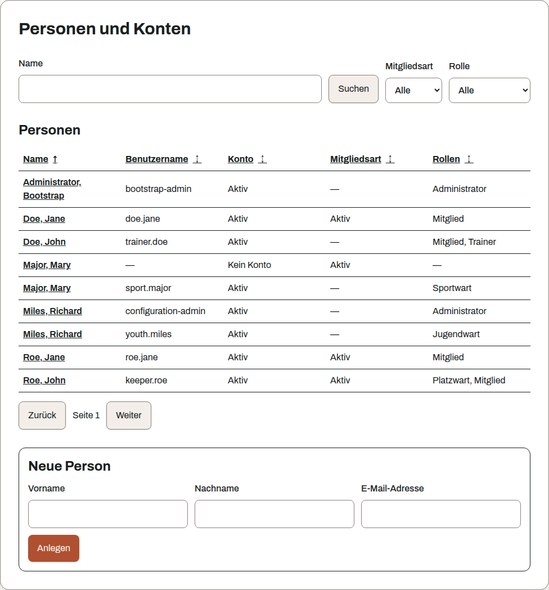

Nach dem Öffnen einer Person stehen drei Bereiche bereit:

* Unter **Person** bearbeitest du Stammdaten und die Sprache der Benachrichtigungen.
* Unter **Mitgliedschaft** bearbeitest du Mitgliedsart, Beginn und Ende. Beende eine
  Mitgliedschaft, statt sie zu löschen. Das Enddatum bleibt korrigierbar.
* Unter **Konto** verwaltest du Benutzername, Rollen, Status und Zugangsdaten. Für ein Konto ist
  eine E-Mail-Adresse erforderlich.

### Zugangsdaten senden

Vor dem Senden zeigt Courtside die Zieladresse und weist auf gemeinsam verwendete Adressen hin. Das
Einmalpasswort geht direkt an das Mitglied und wird dem Vorstand nicht angezeigt.

Neue Zugangsdaten ersetzen ein bereits gesetztes Passwort und beenden alle Sitzungen des Kontos.
Verwende diese Funktion nur, wenn das Mitglied sein Konto nicht selbst wiederherstellen kann.

Administratoren können die E-Mail-Adresse ändern und anschließend neue Zugangsdaten anfordern. Das
Änderungsprotokoll hält beide Vorgänge mit Zeitpunkt und ausführendem Konto fest, aber weder die
Adresse noch das Passwort. Organisatorische Kontrolle, etwa mehrere verantwortliche Personen,
bleibt Aufgabe des Vereins.

### Konto deaktivieren

Deaktiviere das Konto, wenn eine Person keinen Zugriff mehr erhalten soll. Courtside beendet
alle Sitzungen. Buchungen und Auswertungen bleiben erhalten. Das Konto kann später wieder aktiviert
werden.

### Daten einer Person ausgeben

*Auskunft über gespeicherte Daten* erstellt eine Datei mit den Daten dieser Person. Sie enthält
Personen- und Kontodaten, Mitgliedschaft, Buchungen, Serien, Nachrichten, Abwahlen,
Importreferenzen und zugehörige Einträge im Änderungsprotokoll. Prüfe die Datei vor der
Weitergabe. Die Erstellung selbst erscheint danach im Änderungsprotokoll.

Die gesamte Personenliste kannst du als CSV exportieren. Optional enthält sie die
Mitgliedsnummern einer Importquelle.

## Mitglieder → Import

Nutze den Import, wenn eine andere Mitgliederverwaltung die führende Liste des Vereins
enthält. Der Ablauf besteht aus Quelle, Vorschau und Ausführung.

### Beispiel für einen Probelauf

Die [vollständige Beispieldatei](/examples/roster-import-example.csv) enthält 24 erfundene
Personen: 18 Erwachsene und 6 Jugendliche. Die
[geänderte Beispieldatei](/examples/roster-import-example-update.csv) enthält 23 dieser Personen.
Sie ändert die E-Mail-Adresse von `EX-1001`, ordnet `EX-1002` der Kategorie `Junior` zu und lässt
`EX-2006` weg. Alle Adressen verwenden die reservierte Domain `example.org`.

Bereite für einen reproduzierbaren Probelauf eine frische Testinstanz so vor:

1. Lege aktive Mitgliedsarten namens `Adult` und `Junior` an. Aktiviere bei beiden
   *Zugang beim Import anlegen*, wenn der Probelauf auch die Kontoerstellung prüfen soll.
2. Lege eine Importquelle namens `Acceptance example` mit UTF-8 und dem Trennzeichen Semikolon an.
3. Ordne die Spalten wie folgt zu:

| CSV-Spalte | Courtside-Feld |
|---|---|
| `Member number` | Mitgliedsnummer |
| `First name` | Vorname |
| `Last name` | Nachname |
| `Email` | E-Mail-Adresse |
| `Category` | Kategorie |

4. Ordne den Wert `Adult` der gleichnamigen Mitgliedsart und `Junior` der gleichnamigen
   Mitgliedsart zu. Markiere Vorname, Nachname, E-Mail-Adresse und Kategorie als von der Quelle
   geführte Felder.

Spiele die Dateien in dieser Reihenfolge durch:

| Schritt | Datei und Modus | Erwartetes Ergebnis |
|---|---|---|
| Erstimport | vollständige Datei, vollständige Liste | Die Vorschau zeigt 24 neue Personen, davon 18 `Adult` und 6 `Junior`. Bei aktivierter Kontoerstellung plant sie 24 Konten. Nach der Ausführung enthält eine Personenliste, die vorher nur das Administratorkonto enthielt, zusätzlich 24 Personen. |
| Wiederholung | vollständige Datei, vollständige Liste | Die Vorschau enthält keine Personenänderung, keine neue Mitgliedschaft und kein neues Konto. |
| Teilliste | geänderte Datei, Teilliste | Die Vorschau ändert zwei Personen. `EX-2006` bleibt mit laufender Mitgliedschaft erhalten, weil eine Teilliste fehlende Zeilen ignoriert. |
| Ausgangsdaten wiederherstellen | vollständige Datei, Teilliste | Die beiden geänderten Werte werden zurückgesetzt. Alle 24 importierten Mitgliedschaften laufen wieder im Ausgangszustand. |
| Vollständige Liste | geänderte Datei, vollständige Liste | Die Vorschau ändert zwei Personen und warnt vor einer endenden Mitgliedschaft. Nach der Ausführung bleiben 24 Personen gespeichert, davon haben 23 eine laufende Mitgliedschaft. Das reine Mitgliedskonto von `EX-2006` wird deaktiviert. |

Führe den letzten Schritt nur in einer Testinstanz aus. Ein späterer Import aktiviert ein dadurch
deaktiviertes Konto oder eine entfernte Mitgliedsrolle nicht automatisch wieder.

### 1. Quelle beschreiben

Hinterlege Bezeichnung, Trennzeichen, Zeichensatz und Spaltenzuordnung. Ordne externe
Kategorien den Mitgliedsarten in Courtside zu.

Markiere außerdem die Felder, die die Quelle künftig führen soll. Bei bestehenden Personen
überschreibt jeder Import diese Felder. Nicht markierte Felder bleiben unverändert. Neue Personen
erhalten beim ersten Import trotzdem alle zugeordneten Werte aus der Datei.

Prüfe diese Entscheidung besonders für die E-Mail-Adresse. An diese Adresse gehen
Einmalpasswörter und Codes zur Kontowiederherstellung.

Die Beispieldatei für die Spaltenzuordnung bleibt im Browser und wird nicht hochgeladen.

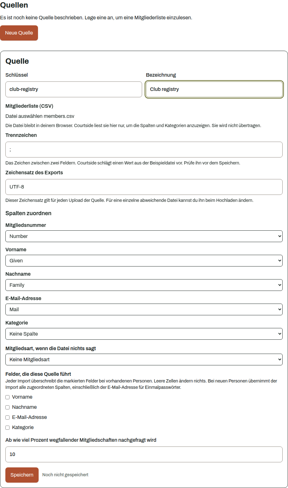

### 2. Datei prüfen

Der Upload erzeugt zuerst eine Vorschau. Noch ändert sich keine Person. Die Vorschau zeigt
Dateiname, Zeilenzahl, Prüfsumme, Änderungen, übersprungene Zeilen, mögliche Dubletten, gemeinsam
verwendete E-Mail-Adressen und geplante Konten.

Die Datei selbst wird nicht gespeichert. Die ermittelte Änderungsmenge mit Namen, Adressen und
Mitgliedsnummern bleibt bis zum Ende ihrer Aufbewahrungsfrist in der Instanz.

Wähle den passenden Modus:

* Eine **Teilliste** ändert nur enthaltene Personen.
* Eine **vollständige Liste** beendet Mitgliedschaften, deren Zeilen fehlen. Reine Mitgliedskonten
  werden deaktiviert. Konten mit zusätzlichen Rollen bleiben aktiv, verlieren aber die
  Mitgliedsrolle. In beiden Fällen enden die Sitzungen.

Ein Import erkennt Personen nur an Mitgliedsnummer und Quelle. Verknüpfe bereits erfasste
Personen vor der Ausführung, sonst entstehen Dubletten. Prüfe gleichnamige Personen und
gemeinsam verwendete E-Mail-Adressen von Hand.

### 3. Import ausführen

Prüfe die Zusammenfassung und wähle *Import ausführen*. Überschreitet der Anteil
endender Mitgliedschaften die eingestellte Schwelle, verlangt Courtside eine zusätzliche
Bestätigung. Die gesamte Änderungsmenge wird in einer Datenbanktransaktion gespeichert.

Ein späterer korrekter Import stellt deaktivierte Konten oder entfernte Mitgliedsrollen nicht
automatisch wieder her. Nach einer versehentlich unvollständigen Liste musst du betroffene Konten
aktivieren und Mitgliedsrollen neu vergeben.

## Nachweise

Unter **Nachweise** findest du fünf Ansichten.

* **Auslastung** zeigt bestätigte Spielzeit je Platz. Plätze ohne Buchung sind enthalten.
* **Datenexport** erstellt CSV-Dateien für Buchungen oder Mitglieder. Der Buchungsexport enthält
  keine buchende Person. Der Mitgliederexport enthält personenbezogene Daten und erzeugt keinen
  Eintrag im Änderungsprotokoll.
* **Änderungsprotokoll** zeigt administrative Änderungen mit Zeitpunkt, Gegenstand und
  ausführendem Konto. Suche nach dem Namen eines Gegenstands oder einem Benutzernamen und grenze
  die Treffer bei Bedarf nach der Art der Änderung und dem Zeitraum ein. *Weitere laden* behält
  die aktiven Filter bei; *Filter zurücksetzen* zeigt wieder das vollständige Protokoll.
* **Nachrichtenprotokoll** zeigt den Versandstatus. *Übergeben* bedeutet nur, dass der Mailserver
  die Nachricht angenommen hat. Die endgültige Zustellung steht allein in dessen Protokoll.
* **Betriebsprotokoll** zeigt jüngste, vor der Speicherung bereinigte Meldungen aus Anwendung,
  Datenbank und Reverse-Proxy. Filtere nach gemeldeter Quelle, Schweregrad, Vereinszeit, Meldung oder Trace-ID.
  Hinweise über fehlende, entfernte oder unvollständige Daten gehören zum Ergebnis. Die Ansicht ist
  kein dauerhaftes Logarchiv und zeigt keine beliebigen Container des Servers. Die Quelle ist nicht
  authentifiziert: Ein lokaler Prozess auf dem Server kann einen der festen Quellnamen nachahmen.

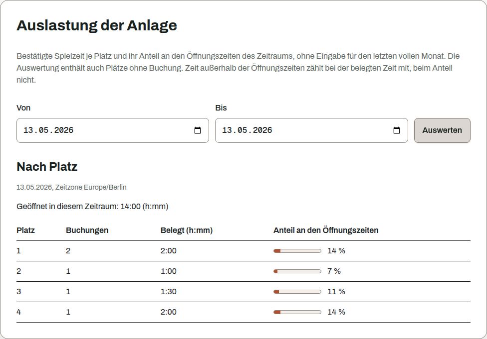

## Zwei Regeln, die überall gelten

Courtside bewahrt fachliche Historie auf. Deaktiviere Plätze, Buchungskarten und Konten oder lege
Regelwerke und Mitgliedsarten still. Beende Mitgliedschaften. Lösche diese Daten
nicht, wenn die Vergangenheit weiterhin nachvollziehbar bleiben soll.

Eingabefehler bleiben korrigierbar. Ändere Namen, Benutzernamen und Datumsangaben in der
jeweiligen Verwaltung. Dafür ist kein direkter Datenbankzugriff nötig.

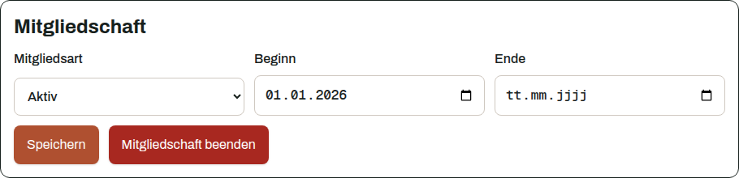
