# Board handbook

This handbook covers initial setup and routine administration of a Courtside instance. Button and
menu names appear in *italics*. Each club chooses its own opening hours, deadlines and limits.

## Who sees the administration

Only enabled accounts with the **Administrator** role can open the administration. These accounts
see *Administration* in the main navigation. Other accounts cannot enter by typing the address
directly.

The sidebar divides administration into four areas:

| Area | Contents |
|---|---|
| **Club** | Setup and configuration |
| **Facility** | Courts, opening hours, booking cards and slot fillers |
| **People** | People, accounts, membership types and imports |
| **Records** | Utilisation, data exports, change log and message log |

The same sidebar returns you to the court plan.

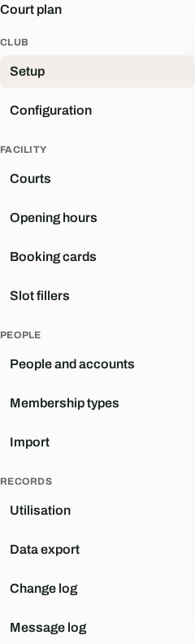

## The guided path: Setup

Open *Club → Setup*. The overview checks the current state and marks every step as complete, open or
optional.

Complete the steps in this order:

1. **Configure the club.** Enter its name, colours, logo, language, time zone and account settings.
2. **Prepare the facility.** Add at least one enabled court and one open weekday.
3. **Offer membership types.** Connect membership types to booking rules and account rights.
4. **Add members.** Record at least one current membership.
5. **Import members.** This is only needed when another membership system holds the authoritative
   list.

You can leave the overview at any time. Courtside recalculates its state when you return.

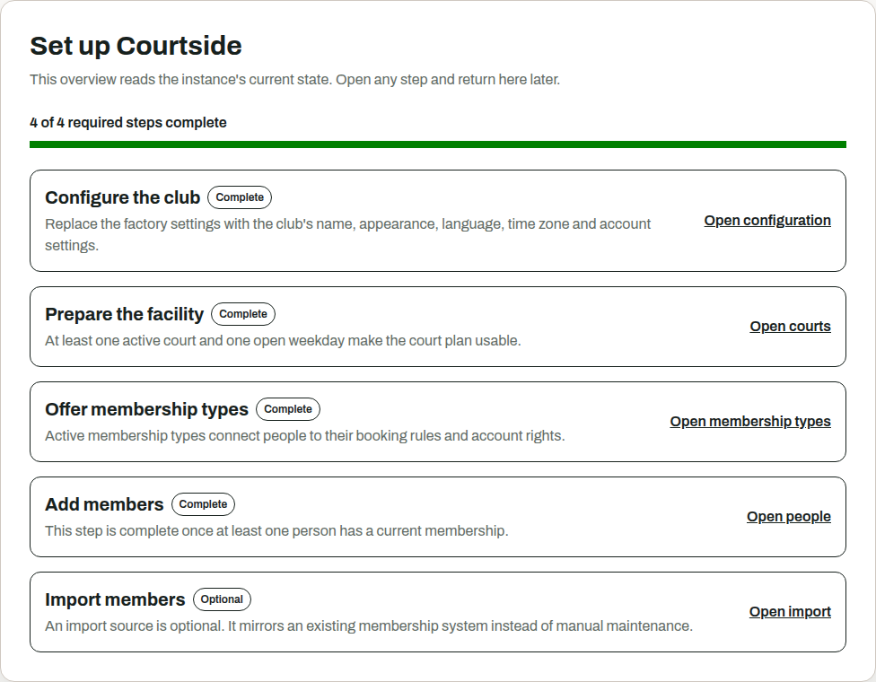

## Club → Configuration

Open *Club → Configuration* to edit settings for the whole instance.

### Club and appearance

Enter the club name, primary colour, accent colour and logo. Courtside shows each colour's contrast
against light and dark text. Normal text requires a ratio of at least 4.5 to 1.

Logos must be PNG or JPEG files. The file may be at most 1 MiB and 2048 by 2048 pixels. An uploaded
file replaces the logo URL until you remove it.

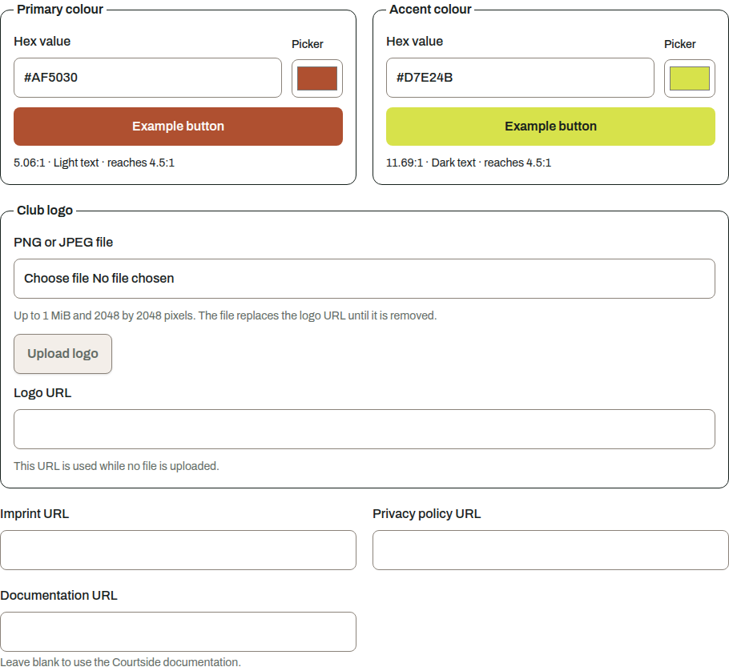

### Links, language and time

* Enter the club's own pages under **Imprint** and **Privacy policy**.
* Under **Documentation** you can link a guide of your own. Left empty, the footer link opens the
  Courtside documentation. The link is always visible, and the address you enter is readable
  without signing in, like the imprint and privacy links. Do not enter anything there that should
  stay private.
* The **Default language** applies to people who have not selected one.
* Enter a valid IANA time zone such as `Europe/Berlin`. You can only change it while there are no
  future bookings.
* The **Booking grid** determines the rows in the court plan and the permitted start times.

### Messages and credentials

* Set **Reminder before a booking** to 0 to disable reminders. Any other value sets the interval in
  hours.
* Set separate lifetimes for one-time passwords issued to new and reset accounts.
* A password reset code may remain valid for between 15 minutes and one day. The member must
  request a new code after it expires.

### People without a membership type

Select a rule set for people without a current membership type if membership-related rules should
still apply to them. Opening hours and the booking grid apply even without this selection.

## Facility → Courts

A court needs a unique number and a name. You can edit both later.

Deactivate a court that the club no longer uses. It disappears from the court plan but remains in
past bookings and reports. Courtside notifies members whose future bookings are affected.

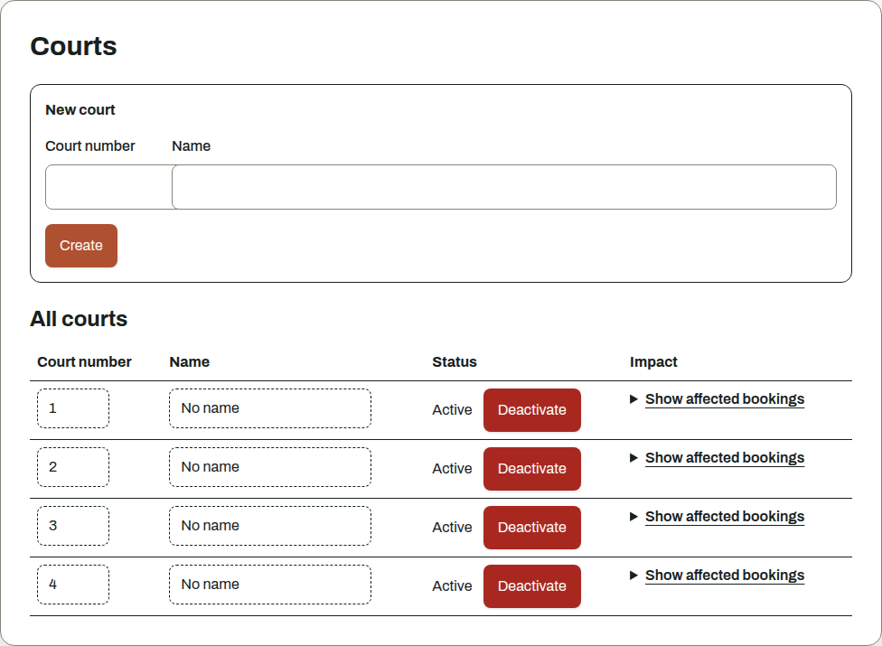

## Facility → Opening hours

1. Enter an opening and closing time for every open weekday.
2. Mark days without play as closed.
3. Use *Apply the same times* to copy one period to several days.
4. Save the whole week.

Courtside does not save a day when either time is missing. Members cannot book outside the opening
hours. If you shorten opening hours later, Courtside notifies members with affected bookings.

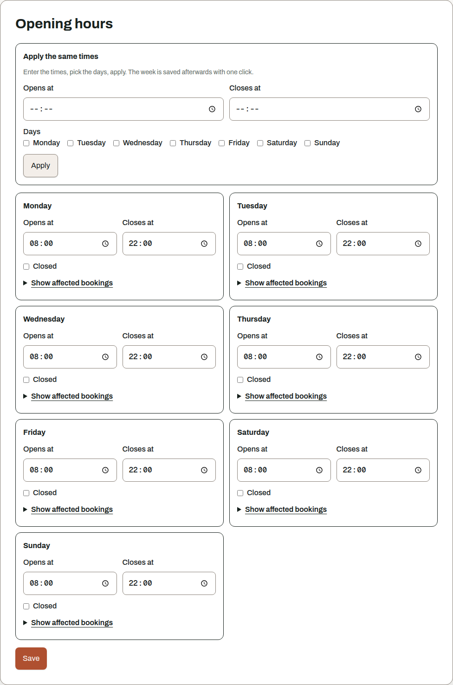

## Facility → Booking cards

Booking cards distinguish types of court occupancy, such as a member game, training, league match
or closure. Add one card for every type the club needs.

| Setting | Effect |
|---|---|
| **Label and colour** | Appearance in the court plan |
| **Allowed roles** | Roles that may book with the card. With no selection, every signed-in person may book |
| **Managing roles** | Roles that may open, inspect and cancel every booking made with this card |
| **Allowed player counts** | Permitted participant counts. With no value, the card records no participants |
| **Counts against booking limits** | Counts the booking towards the member's open-booking limit |
| **Guests allowed** | Allows named guests |
| **Show neutral occupancy** | Shows *Occupied* instead of the card label in the public plan |

Administrators may use and manage every card. A neutral display does not hide the label from
technical access because the public API still returns it. Do not use confidential labels.

Deactivate cards that are no longer needed. Existing bookings remain in place.

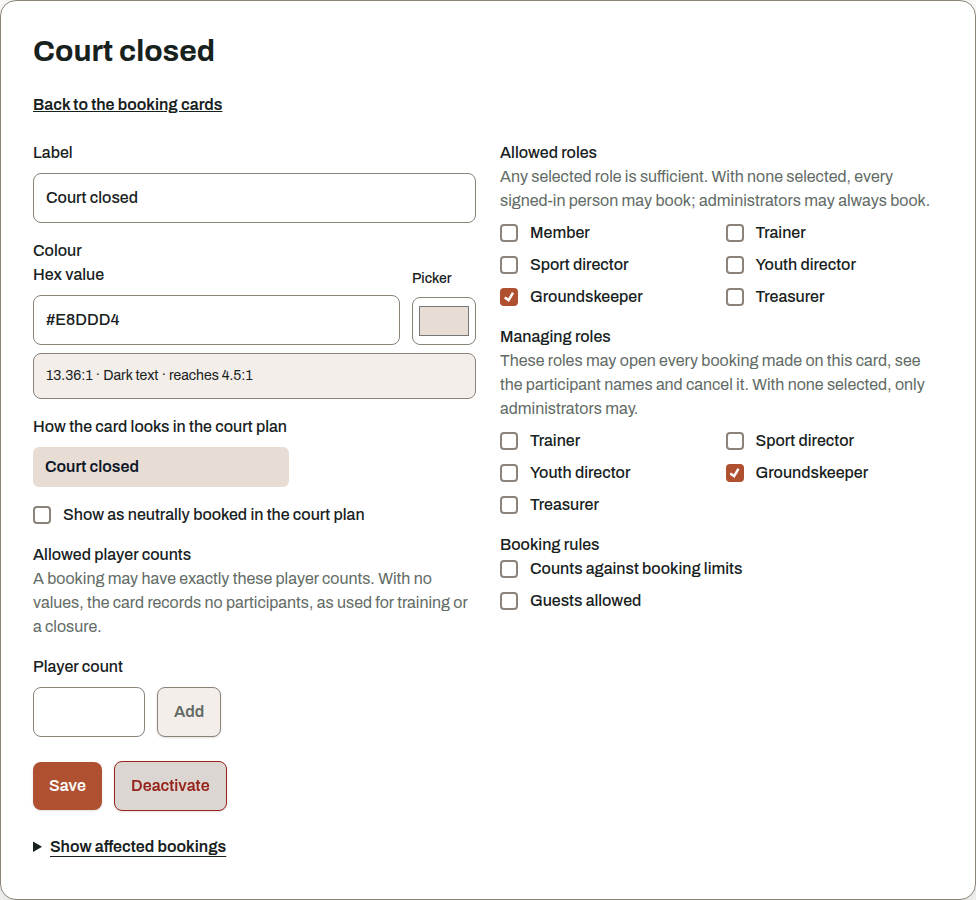

## Facility → Slot fillers

A slot filler occupies a player slot without representing a person. Examples include a ball
machine or a "looking for a partner" entry.

Enter a label and an optional available count. An empty count allows any number of simultaneous
uses. If all limited items are booked, Courtside refuses further selections for that period.

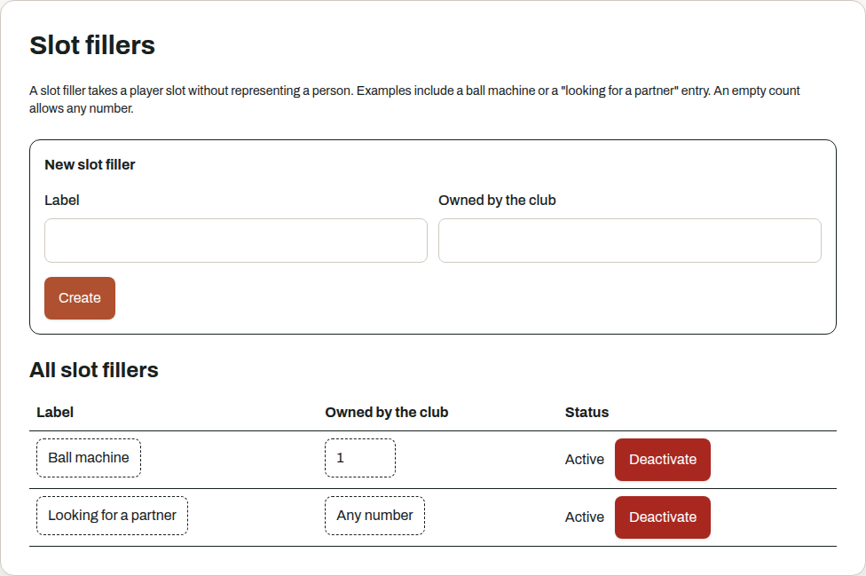

## Booking rules

Open the booking rules under *Club → Configuration*. A membership type points to a rule set. Each
rule set may contain these rules once:

| Rule | Setting |
|---|---|
| Advance booking window | Highest number of days in advance |
| Open bookings | Highest number of open bookings at the same time |
| Maximum booking duration | Highest duration in minutes |
| Cancellation deadline | Minimum number of minutes before the booking |
| Booking barred | Prevents members from booking and moving without another setting |

Opening hours and the booking grid apply across the club, so they sit outside rule sets.
Administrators may override the booking prohibition for administrative work. Time and court
constraints still apply to them.

Retiring a rule set does not stop it from applying to membership types already assigned to it. It
only removes the set from new selections. Assign another rule set first if the affected members
should receive different rules.

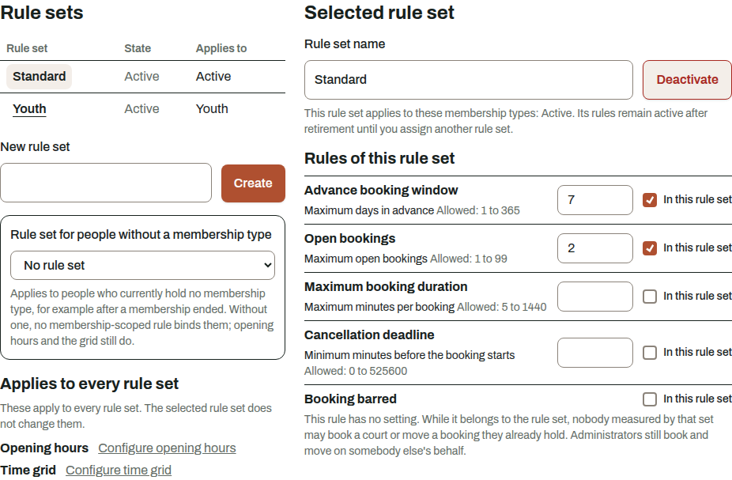

## People → Membership types

A membership type has a label, a rule set and an import setting.

Enable **Open an account on import** if imported members of this type should receive an account.
Courtside sends the one-time password to the recorded email address. Existing accounts remain
unchanged.

Retiring a type preserves existing assignments and booking rules. The type can no longer be
assigned to new memberships.

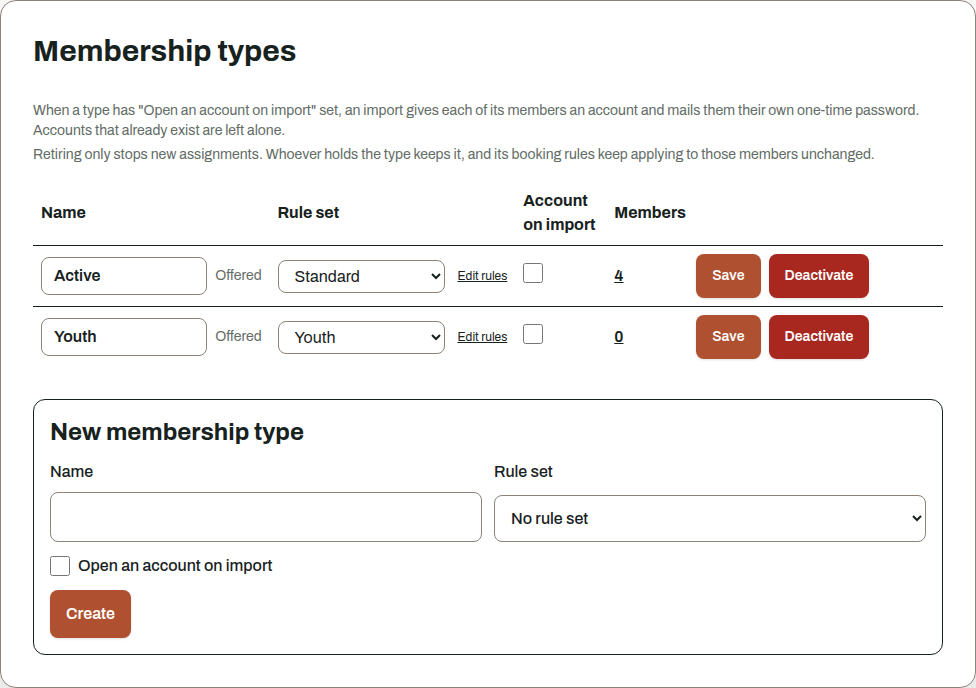

## People → People and accounts

The overview shows name, username, account state and membership type. Use search and filters to
find an entry. You can correct first name, last name and email address later.

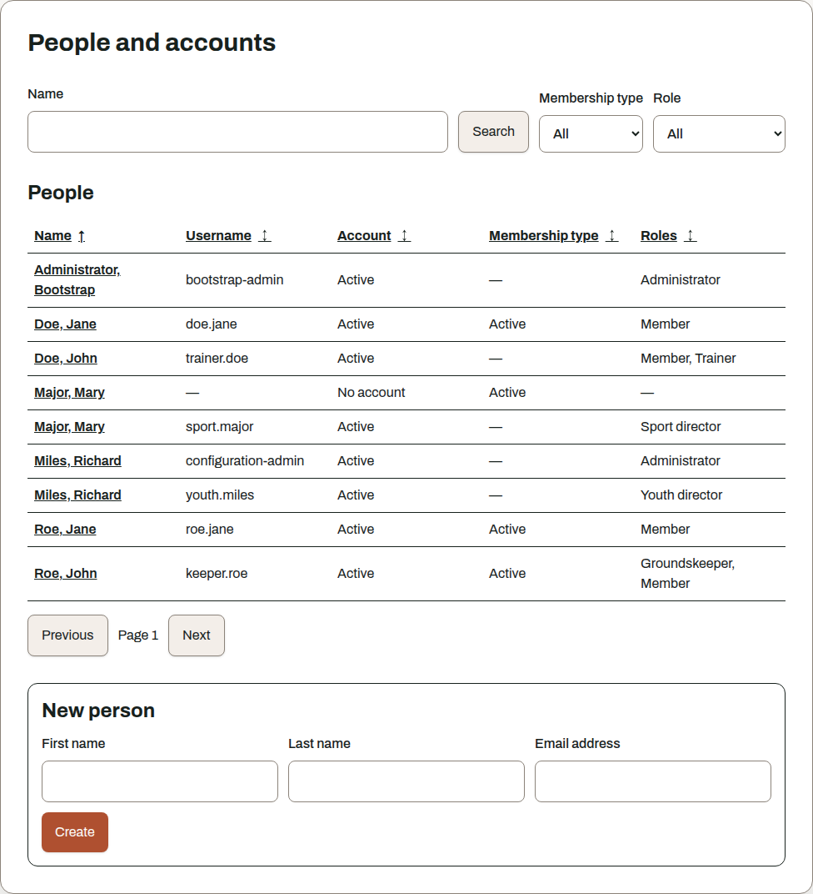

After opening a person, you can edit three areas:

* **Person** contains personal details and the language used for notifications.
* **Membership** contains type, start and end. End a membership instead of deleting it. You can
  correct the end date later.
* **Account** contains username, roles, state and credentials. An account requires an email address.

### Send credentials

Before sending, Courtside shows the destination address and warns about shared addresses. The
one-time password goes directly to the member and is not displayed to the board.

New credentials replace an existing password and end every session for the account. Only use this
function when the member cannot recover the account without help.

Administrators can change an email address and then request new credentials. The change log records
both actions with their time and acting account, but it records neither the address nor the
password. Organisational controls, such as sharing responsibility between several people, remain
the club's responsibility.

### Deactivate an account

Deactivate the account when a person should no longer have access. Courtside ends every session.
Bookings and reports remain intact. You can enable the account again later.

### Export one person's data

*Answer a data access request* creates a file containing data about this person. It includes person
and account details, membership, bookings, series, messages, opt-outs, import references and
related change-log entries. Inspect the file before sharing it. Creating the file is itself written
to the change log.

You can export the whole people list as CSV. It may also include member numbers from one import
source.

## People → Import

Use the import when another membership system holds the club's authoritative list. The process has
three stages: source, preview and execution.

### Example acceptance run

The [complete example file](/examples/roster-import-example.csv) contains 24 fictional people:
18 adults and 6 juniors. The
[changed example file](/examples/roster-import-example-update.csv) contains 23 of those people.
It changes the email address of `EX-1001`, assigns `EX-1002` to the `Junior` category and omits
`EX-2006`. Every address uses the reserved `example.org` domain.

Prepare a fresh test instance for a repeatable run:

1. Create active membership types named `Adult` and `Junior`. Enable *Open an account on import* for
   both when the run should also exercise account creation.
2. Create an import source named `Acceptance example` with UTF-8 and a semicolon separator.
3. Map the columns as follows:

| CSV column | Courtside field |
|---|---|
| `Member number` | Member number |
| `First name` | First name |
| `Last name` | Last name |
| `Email` | Email address |
| `Category` | Category |

4. Map `Adult` to the membership type with that name and `Junior` to the membership type with that
   name. Mark first name, last name, email address and category as fields owned by the source.

Run the files in this order:

| Step | File and mode | Expected result |
|---|---|---|
| First import | complete file, complete list | The preview shows 24 new people, 18 `Adult` and 6 `Junior`. With account creation enabled, it plans 24 accounts. After execution, a roster that previously contained only the administrator account contains 24 additional people. |
| Repeat | complete file, complete list | The preview contains no person change, new membership or new account. |
| Partial list | changed file, partial list | The preview changes two people. `EX-2006` keeps an active membership because a partial list ignores missing rows. |
| Restore the baseline | complete file, partial list | The two changed values return to their original values. All 24 imported memberships are active in their original state. |
| Complete list | changed file, complete list | The preview changes two people and warns about one ending membership. After execution, all 24 people remain stored and 23 have an active membership. The member-only account belonging to `EX-2006` is disabled. |

Run the last step only on a test instance. A later import does not automatically enable an account
or restore a member role removed by a complete-list import.

### 1. Describe the source

Enter the label, separator, character set and column mapping. Map external categories to membership
types in Courtside.

Mark the fields that this source should own. Every later import overwrites owned fields on existing
people. Unmarked fields remain unchanged. New people still receive every mapped value from the
file during their first import.

Review this choice carefully for the email address. Courtside sends one-time passwords and account
recovery codes there.

The example file used for mapping stays in the browser and is not uploaded.

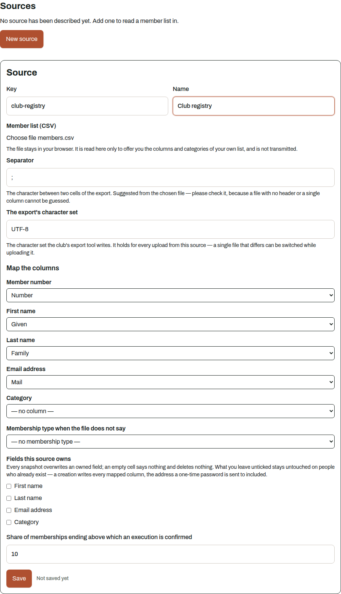

### 2. Review the file

An upload first creates a preview and does not change any person. The preview shows the file name,
row count, checksum, changes, skipped rows, possible duplicates, shared email addresses and planned
accounts.

Courtside does not store the file itself. It keeps the calculated changes, including names,
addresses and member numbers, until the preview expires.

Choose the correct mode:

* A **partial list** only changes people contained in the file.
* A **complete list** ends memberships whose rows are missing. Accounts with only the member role
  are deactivated. Accounts with additional roles remain enabled but lose the member role. Both
  cases end their sessions.

An import identifies people only by source and member number. Link people who already exist before
execution, or the import will create duplicates. Review similar names and shared email addresses by
hand.

### 3. Run the import

Review the summary and select *Run import*. If the share of ending memberships exceeds the source's
threshold, Courtside requires another confirmation. It saves the complete set of changes in one
database transaction.

A later correct import does not automatically reactivate accounts or restore removed member roles.
After importing an incomplete file by mistake, enable affected accounts and assign their member
roles again.

## Records

The **Records** area has five views.

* **Utilisation** shows confirmed playing time by court. It includes courts without bookings.
* **Data export** creates CSV files for bookings or members. The booking export omits the person who
  booked. The member export contains personal data and creates no change-log entry.
* **Change log** lists administrative changes with time, subject and acting account. Search by a
  subject name or username and narrow the result by event type and time range when needed. *Load
  more* keeps the active filters; *Clear filters* returns to the complete log.
* **Message log** shows delivery state. *Handed over* only means that the mail server accepted the
  message. Final delivery is recorded by the mail server, not Courtside.
* **Operational log** shows recent records from the application, database and reverse proxy after
  pre-storage redaction. Filter by reported source, severity, club-local time, message or trace ID. Warnings
  about unavailable, expired or incomplete evidence are part of the result. The view is not a
  durable log archive and cannot inspect arbitrary server containers. The source is not
  authenticated: a local process on the server can imitate one of the fixed source names.

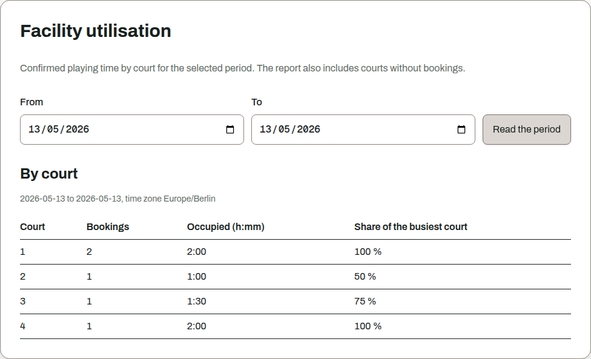

## Two rules that hold everywhere

Courtside keeps the domain history. Deactivate or retire courts, booking cards, rule sets,
membership types and accounts. End memberships. Do not delete these records if past activity must
remain traceable.

Input mistakes remain correctable. Edit names, usernames and dates in the relevant administration
page. No direct database access is needed.

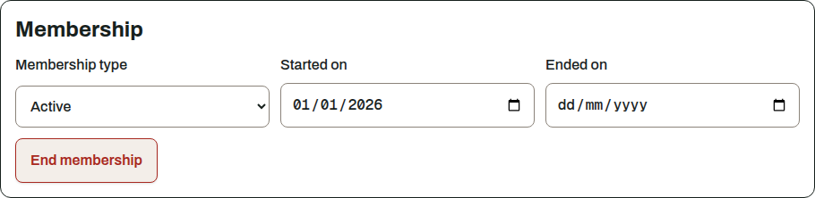
