# Member handbook

This handbook explains the features you need as a member. Button and menu names appear in
*italics*. Your club sets its own opening hours, deadlines and limits.

## The court plan is public

The home page shows the court plan without requiring you to sign in. A wide screen shows one week.
A narrow screen shows one day.

1. Select *Previous week* or *Next week* to change the period.
2. Select *Return to current time* to return to today.
3. Use the legend to identify **Available**, **Occupied**, **Your booking**, **Unavailable** and
   **Past** periods.

Courtside does not show a grid on days when the club is closed. Another member's booking displays
either its booking type or the neutral label *Occupied*. The club chooses this for each booking
type. The number of participants is public, but their names are not. You only see names on your
own bookings.

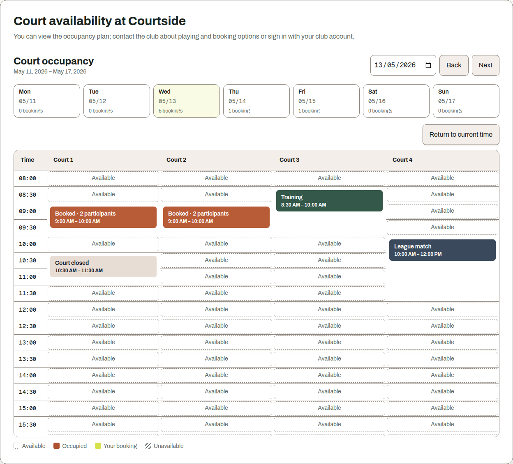

## Signing in

The board creates your account. Courtside emails you the username and a one-time password. Nobody
on the board sees or chooses that password.

1. Select *Sign in*.
2. Enter your username and password.
3. Select *Sign in* again.

Check the values first if Courtside refuses the sign-in. Your credentials may have expired, or the
email may not have arrived. In either case, use *Forgotten your password or username?*. Only the
board can reactivate a deactivated account.

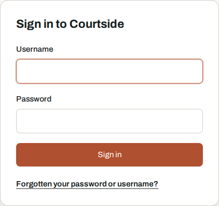

## Forgotten password or username

Account recovery does not require you to sign in. The page has three separate forms.

### Request a code

1. Enter your username.
2. Select *Send code*.
3. Open the email containing the eight-character code.

Your current password remains valid. Open sessions stay signed in.

### Redeem a code

1. Enter the code from the email.
2. Choose a new password.
3. Select *Set password*.

Only the new password works afterwards. Courtside ends every open session for the account. A
rejected password does not consume the code. The code is not case-sensitive, and you may omit its
hyphen. Request a new code if the old one has expired.

### Request your usernames

Enter your email address and select *Send usernames*. Courtside sends a separate message for every
account registered to that address. Passwords remain unchanged.

Courtside gives the same response when a username or address is unknown. This prevents visitors
from using the form to search for accounts. If no email arrives, check the username and the inbox.
Ask the board if you still cannot recover the account.

Too many attempts cause a waiting period. Sign-in and code redemption count attempts from the
shared internet connection. Code requests also count the submitted username or address. Other
people on the same network can therefore reach the same limit. Your current password remains
unaffected.

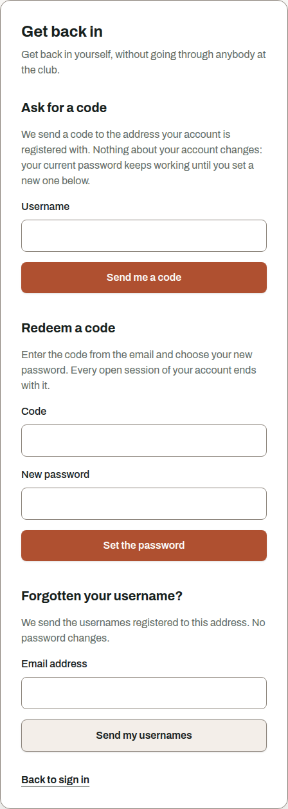

## Replacing the one-time password

A one-time password is only for first access or an account reset by the board. After signing in,
Courtside opens *Replace one-time password*. Other features remain unavailable until you set your
own password.

1. Enter the new password twice.
2. Select *Save password*.
3. Sign in again with the new password.

The password must contain between 12 and 256 characters. Courtside rejects common passwords and
passwords containing your name, username, email address, the club name or a term blocked by the
club. It must also differ from your current or issued password.

Courtside asks a public service whether the password appears in a known data breach. Only the first
five characters of a checksum leave the instance. The service does not receive your password. If
the check is unavailable, Courtside does not save the password. Try again later.

If the one-time password has expired, request a code from the sign-in page. You can use that code
to set a new password yourself.

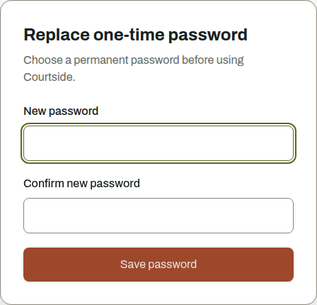

## Creating a booking

1. Select an available cell in the court plan. This sets the court and start time.
2. Choose an allowed **Duration**.
3. Choose the **Booking type**.
4. Add members if needed.
5. Open *More details* to add guests, slot fillers or a note.
6. Select *Book now*.

A normal member account books the selected court. Accounts with additional roles may choose
several courts, for example for a training session.

The database checks that the court is still available when it saves the booking. If somebody
booked the same period moments earlier, Courtside refuses your request. It never creates two
bookings for the same court and time.

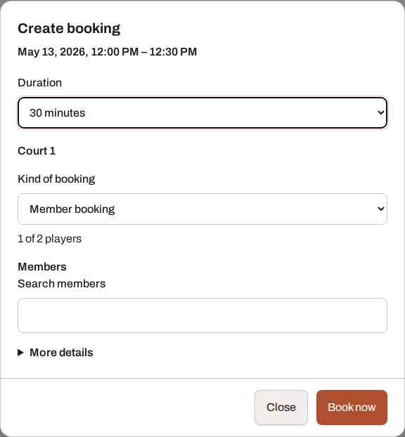

## What a kind of booking means

A booking type controls how Courtside handles an occupancy. It may represent a game, training,
league match or closure.

The booking type determines:

* how many people can be recorded,
* whether guests are allowed,
* whether the booking counts against your open-booking limit,
* which roles may use the booking type.

The board configures the booking types. The booking dialog only offers the types you may use.

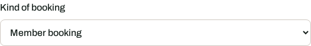

## Players and guests

The booking dialog shows how many player slots are already filled.

* Search for **Members** by name and add them. Each member can occupy only one player slot in a
  booking.
* Enter **Guests** by name under *More details*. The field only appears for booking types that
  allow guests.
* Under ***What plays***, select a slot filler such as a ball machine or a "looking for a partner"
  entry. Courtside reports when none are available at the chosen time.

Recorded members receive an email. They do not need to accept the booking and can remove
themselves later.

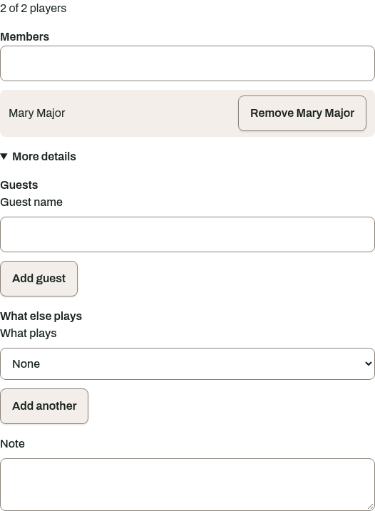

## Recorded as a co-player

Open *My bookings* and go to **Recorded as a co-player**. This section lists bookings that other
members created with your name.

Select *Withdraw* to remove yourself. The booking remains in place. Courtside notifies the person
who created it.

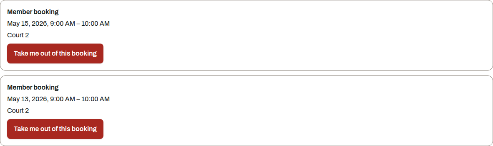

## When a rule refuses the booking

Your membership type determines which booking rules apply to you. Courtside shows all detected
violations at once next to the relevant fields.

| Message | Meaning |
|---|---|
| The facility is closed on this day | The day has no opening hours |
| Bookings are only possible between two times | The booking is outside the opening hours |
| Bookings start on the minute grid | The start does not match the club's grid |
| The duration must be a multiple of the grid | The duration does not match the grid |
| You can only book a certain number of days ahead | The allowed advance period was exceeded |
| A booking may only last a certain number of minutes | The selected duration is too long |
| You have reached the number of open bookings | You must finish or cancel an open booking first |
| You must cancel a certain number of minutes before the start | The cancellation deadline has passed |
| A booking cannot start in the past | The selected start is in the past |
| Court booking is not available to you | Your membership type cannot book courts directly |

The message includes the applicable number. Correct the marked fields and submit the booking again.

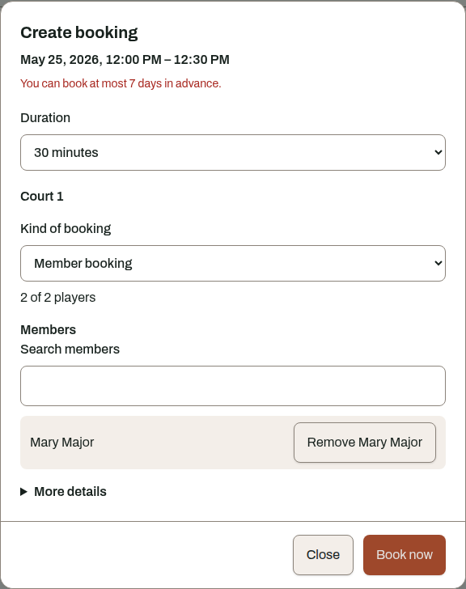

## Cancelling

1. Open *My bookings*.
2. Select *Cancel* on an upcoming booking.
3. Confirm the cancellation.

Courtside releases the court immediately. If the cancellation deadline has passed, the booking
remains and Courtside tells you which deadline applied.

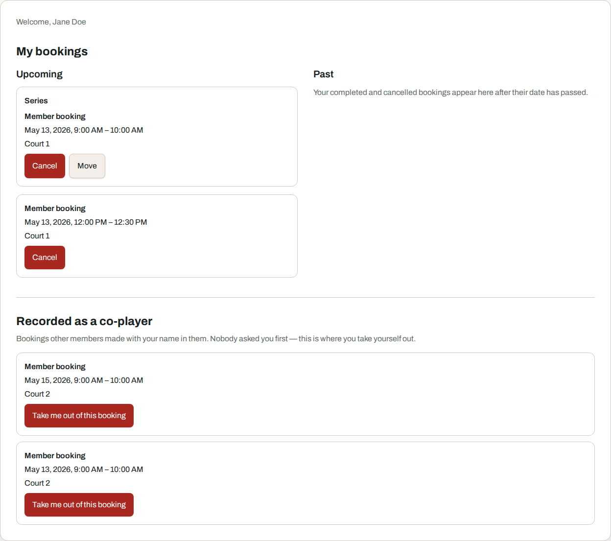

## Series

Accounts with an additional role can create a series under *My bookings*. A series creates normal
bookings from a schedule. You set the first date, time, duration, weekdays, interval in weeks and
the end of the series.

Keep these rules in mind:

* Courtside skips dates that are already occupied and creates the remaining bookings.
* When cancelling or moving bookings, you can choose *This occurrence*, *This and following* or
  *Whole series*.
* Before a move, Courtside shows the affected bookings and any conflicts.
* A series contains no player list. It appears as occupied time in the court plan.

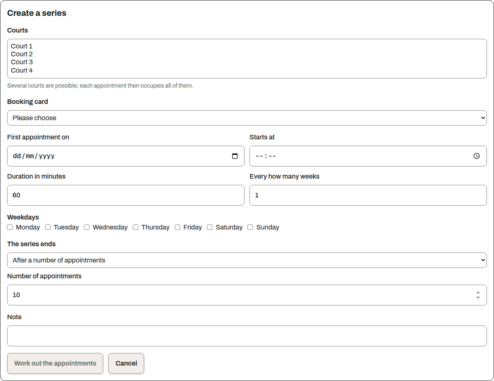

## When something under your booking changes

A later configuration change may affect your booking. Examples include a deactivated court, a
retired booking type or shorter opening hours.

Courtside emails you with the reason. This does not cancel the booking automatically. The club
decides how to handle it.

## Notifications

Open *Notifications* to enable or disable optional messages.

You can disable:

* booking confirmations,
* reminders before a booking,
* messages when somebody withdraws from your booking.

Courtside always sends:

* credentials for a new or reset account,
* notice that somebody added you as a player,
* notice of a change that affects your booking.

Save your choices. They apply to future messages only.

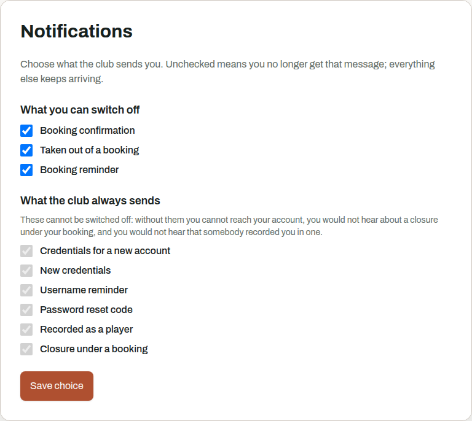

## Your account

Open *Account security* to manage your password and sessions.

You must enter the current password before changing it. After saving, Courtside ends every session,
including the one you are using. Sign in with the new password.

You can also end one session or all sessions. If your sign-in is no longer recent, Courtside asks
for your password before ending other sessions. You can end the current session without that extra
check.

The board can correct errors in your name or username from the people administration.

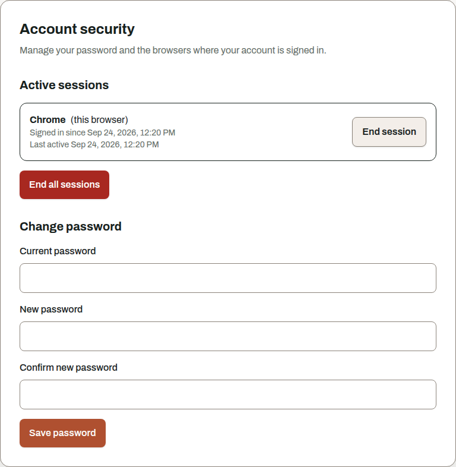
