# Handbuch für Mitglieder

Dieses Handbuch erklärt die Funktionen, die du als Mitglied brauchst. Die Namen von Schaltflächen
und Menüpunkten stehen *kursiv*. Öffnungszeiten, Fristen und Obergrenzen legt dein Verein fest.

## Der Platzplan ist öffentlich

Die Startseite zeigt den Platzplan auch ohne Anmeldung. Auf einem großen Bildschirm siehst du eine
Woche, auf einem schmalen Bildschirm einen Tag.

1. Wähle *Vorherige Woche* oder *Nächste Woche*, um den Zeitraum zu wechseln.
2. Wähle *Zur aktuellen Zeit*, um zum heutigen Tag zurückzukehren.
3. Lies in der Legende, ob ein Zeitraum **Frei**, **Belegt**, **Deine Buchung**,
   **Nicht verfügbar** oder **Vergangen** ist.

An geschlossenen Tagen zeigt Courtside kein Raster. Bei fremden Buchungen siehst du entweder die
Buchungsart oder den neutralen Text *Belegt*. Das stellt der Verein für jede Buchungsart ein. Die
Anzahl der Teilnehmenden ist öffentlich, ihre Namen sind es nicht. Namen siehst du nur bei deinen
eigenen Buchungen.

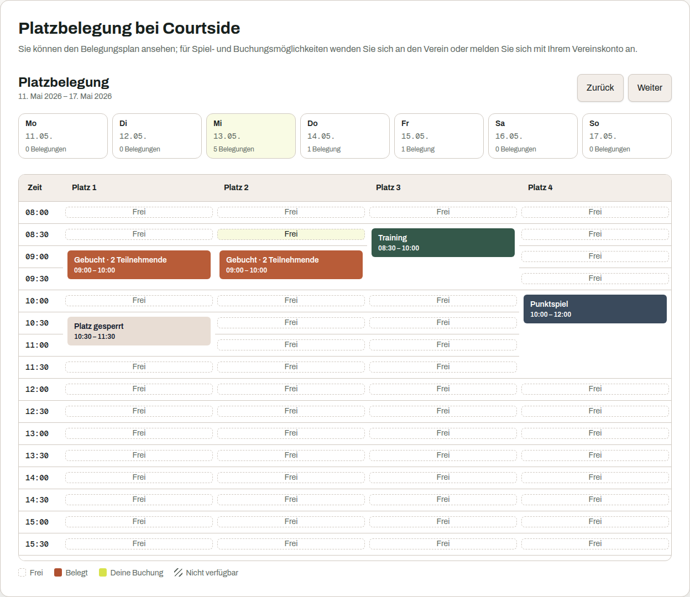

## Anmelden

Der Vorstand legt dein Konto an. Courtside sendet dir den Benutzernamen und ein Einmalpasswort per
E-Mail. Niemand im Vorstand sieht oder bestimmt dieses Passwort.

1. Wähle *Anmelden*.
2. Gib deinen Benutzernamen und dein Passwort ein.
3. Wähle erneut *Anmelden*.

Prüfe bei einer Ablehnung zuerst die Eingabe. Vielleicht sind die Zugangsdaten abgelaufen oder die
E-Mail ist nicht angekommen. Nutze dann *Passwort oder Benutzername vergessen?*. Bei einem
deaktivierten Konto kann nur der Vorstand helfen.

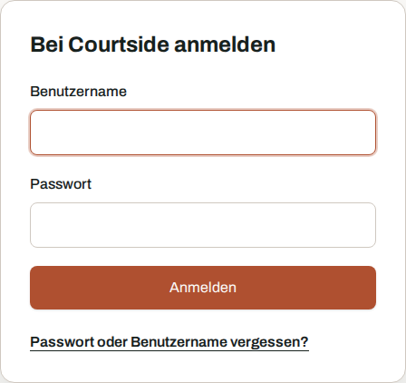

## Passwort oder Benutzername vergessen

Die Wiederherstellung funktioniert ohne Anmeldung. Auf der Seite stehen drei getrennte Formulare.

### Code anfordern

1. Gib deinen Benutzernamen ein.
2. Wähle *Code zuschicken*.
3. Öffne die E-Mail mit dem achtstelligen Code.

Das bisherige Passwort bleibt gültig. Offene Sitzungen bleiben angemeldet.

### Code einlösen

1. Gib den Code aus der E-Mail ein.
2. Lege ein neues Passwort fest.
3. Wähle *Passwort setzen*.

Danach gilt nur noch das neue Passwort. Courtside beendet alle offenen Sitzungen des Kontos. Ein
abgelehntes Passwort verbraucht den Code nicht. Groß- und Kleinschreibung sowie Bindestriche im
Code spielen keine Rolle. Abgelaufene Codes musst du neu anfordern.

### Benutzernamen anfordern

Gib deine E-Mail-Adresse ein und wähle *Benutzernamen zuschicken*. Courtside sendet für jedes Konto
an dieser Adresse eine eigene Nachricht. Passwörter bleiben unverändert.

Courtside antwortet immer gleich, auch wenn der Benutzername oder die Adresse unbekannt ist. So
kann niemand über das Formular nach Konten suchen. Wenn keine E-Mail eintrifft, prüfe den
Benutzernamen und das richtige Postfach. Danach hilft der Vorstand weiter.

Zu viele Versuche führen zu einer Wartezeit. Bei Anmeldung und Code-Eingabe zählt die gemeinsame
Internetverbindung. Beim Anfordern zählt zusätzlich der eingegebene Benutzername oder die Adresse.
Andere Personen im selben Netz können deshalb dieselbe Begrenzung erreichen. Dein bestehendes
Passwort bleibt davon unberührt.

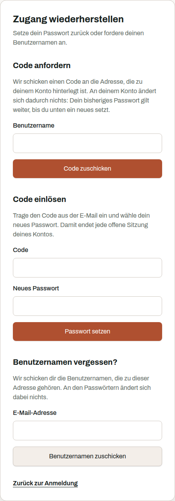

## Das Einmalpasswort ersetzen

Ein Einmalpasswort gilt nur für den ersten Zugang oder für ein vom Vorstand zurückgesetztes Konto.
Nach der Anmeldung führt Courtside dich direkt zu *Einmalpasswort ersetzen*. Andere Funktionen
bleiben gesperrt, bis du ein eigenes Passwort gesetzt hast.

1. Gib das neue Passwort zweimal ein.
2. Wähle *Passwort speichern*.
3. Melde dich mit dem neuen Passwort erneut an.

Das Passwort muss 12 bis 256 Zeichen lang sein. Courtside lehnt häufig verwendete Passwörter ab.
Das gilt auch für Passwörter mit deinem Namen, Benutzernamen, deiner E-Mail-Adresse, dem
Vereinsnamen oder einem vom Verein gesperrten Begriff. Das neue Passwort darf außerdem nicht dem
bisherigen oder dem ausgestellten Passwort entsprechen.

Courtside prüft über einen öffentlichen Dienst, ob das Passwort aus einem bekannten Datenleck
stammt. Dabei verlassen nur die ersten fünf Zeichen eines Prüfwerts die Instanz. Der Dienst erhält
das Passwort nicht. Ist die Prüfung nicht erreichbar, speichert Courtside das Passwort nicht.
Versuche es später erneut.

Ist das Einmalpasswort bereits abgelaufen, fordere über die Anmeldeseite einen Code an. Mit diesem
Code kannst du selbst ein neues Passwort setzen.

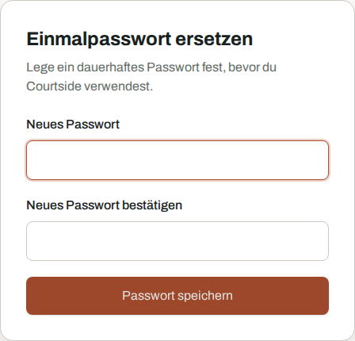

## Eine Buchung anlegen

1. Wähle im Platzplan eine freie Zelle. Sie bestimmt Platz und Beginn.
2. Wähle eine erlaubte **Dauer**.
3. Wähle die **Art der Buchung**.
4. Füge bei Bedarf Mitglieder hinzu.
5. Öffne *Weitere Angaben*, wenn du Gäste, Platzfüller oder eine Notiz eintragen möchtest.
6. Wähle *Jetzt buchen*.

Normale Mitgliedskonten buchen den gewählten Platz. Konten mit zusätzlichen Rollen können mehrere
Plätze auswählen, zum Beispiel für ein Training.

Die Datenbank prüft beim Speichern, ob der Platz noch frei ist. Hat jemand denselben Zeitraum kurz
zuvor gebucht, lehnt Courtside deine Buchung ab. Eine Doppelbelegung entsteht nicht.

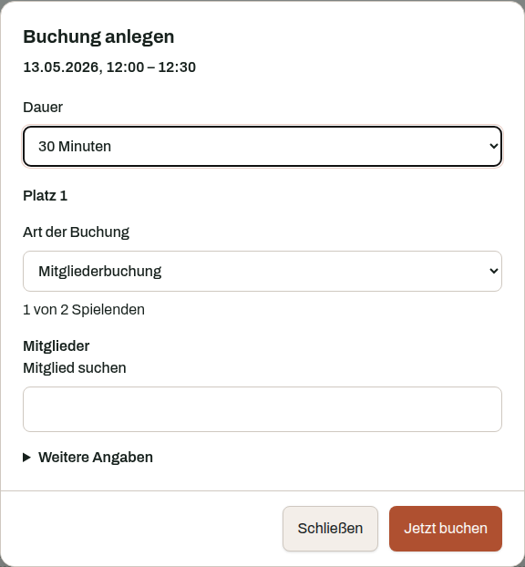

## Was eine Buchungsart bedeutet

Eine Buchungsart legt fest, wie eine Belegung behandelt wird. Das kann ein Spiel, ein Training, ein
Punktspiel oder eine Sperrung sein.

Die Buchungsart bestimmt:

* wie viele Personen eingetragen werden können,
* ob Gäste erlaubt sind,
* ob die Buchung gegen deine Obergrenze offener Buchungen zählt,
* welche Rollen diese Buchungsart verwenden dürfen.

Der Vorstand richtet die Buchungsarten ein. Im Buchungsdialog erscheinen nur die Arten, die du
verwenden darfst.

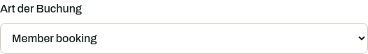

## Mitspieler und Gäste

Der Buchungsdialog zeigt, wie viele Spielerplätze bereits belegt sind.

* Suche **Mitglieder** nach ihrem Namen und füge sie hinzu. Jedes Mitglied kann in einer Buchung
  nur einen Spielerplatz belegen.
* Trage **Gäste** unter *Weitere Angaben* namentlich ein. Das Feld erscheint nur bei passenden
  Buchungsarten.
* Wähle unter ***Was mitspielt*** einen Platzfüller, zum Beispiel eine Ballmaschine oder einen
  Eintrag "Spielpartner gesucht". Courtside meldet, wenn zur gewählten Zeit kein Exemplar frei ist.

Eingetragene Mitglieder erhalten eine E-Mail. Sie müssen der Eintragung nicht zustimmen und können
sich selbst wieder austragen.

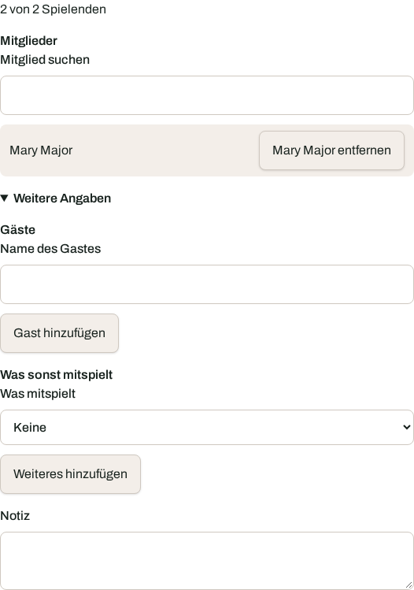

## Als Mitspieler eingetragen

Öffne *Meine Buchungen* und gehe zu **Als Mitspieler eingetragen**. Dort stehen Buchungen, die
andere Mitglieder mit deinem Namen angelegt haben.

Mit *Austragen* entfernst du dich aus der Buchung. Die Buchung bleibt bestehen. Courtside
benachrichtigt die Person, die sie angelegt hat.

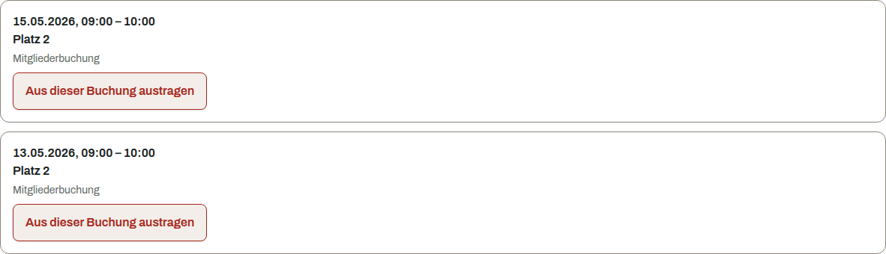

## Wenn eine Regel die Buchung ablehnt

Die Mitgliedsart bestimmt, welche Buchungsregeln für dich gelten. Courtside zeigt alle erkannten
Verstöße gleichzeitig am jeweiligen Feld an.

| Meldung | Bedeutung |
|---|---|
| An diesem Tag ist die Anlage geschlossen | Für den Tag ist keine Öffnungszeit hinterlegt |
| Buchungen sind nur zwischen zwei Uhrzeiten möglich | Die Buchung liegt außerhalb der Öffnungszeit |
| Buchungen beginnen im Minutenraster | Der Beginn passt nicht in das Raster des Vereins |
| Die Dauer muss ein Vielfaches der Rasterlänge sein | Die Dauer passt nicht in das Raster |
| Du kannst höchstens eine bestimmte Zahl von Tagen im Voraus buchen | Der erlaubte Vorlauf ist überschritten |
| Eine Buchung darf höchstens eine bestimmte Zahl von Minuten dauern | Die gewählte Dauer ist zu lang |
| Du hast die erlaubte Zahl offener Buchungen erreicht | Du musst zuerst eine offene Buchung beenden oder stornieren |
| Du musst eine bestimmte Zahl von Minuten vor Beginn stornieren | Die Stornierungsfrist ist abgelaufen |
| Eine Buchung darf nicht in der Vergangenheit beginnen | Der gewählte Beginn liegt in der Vergangenheit |
| Platzbuchungen sind für dich nicht freigegeben | Deine Mitgliedsart darf selbst keine Plätze buchen |

Die konkrete Zahl steht in der Meldung. Ändere die markierten Angaben und sende die Buchung erneut.

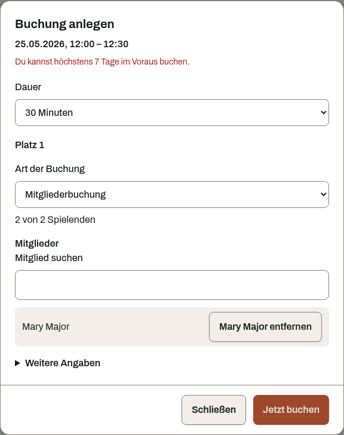

## Stornieren

1. Öffne *Meine Buchungen*.
2. Wähle bei einer bevorstehenden Buchung *Stornieren*.
3. Bestätige die Stornierung.

Courtside gibt den Platz sofort frei. Ist die Stornierungsfrist abgelaufen, bleibt die Buchung
bestehen und Courtside nennt dir die geltende Frist.

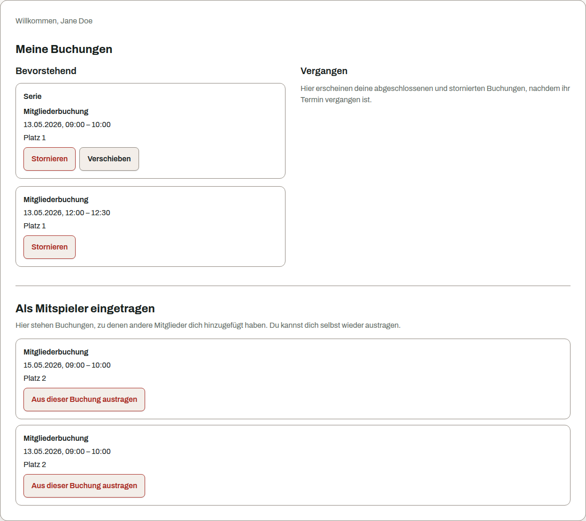

## Serientermine

Konten mit einer zusätzlichen Rolle können unter *Meine Buchungen* Serien anlegen. Eine Serie legt
gewöhnliche Buchungen nach einem Plan an. Du bestimmst den ersten Termin, die Uhrzeit, Dauer,
Wochentage, den Abstand in Wochen und das Ende der Serie.

Beachte dabei:

* Bereits belegte Termine werden übersprungen. Die übrigen Termine legt Courtside an.
* Beim Stornieren oder Verschieben kannst du *Nur dieser Termin*, *Dieser und folgende Termine*
  oder *Ganze Serie* wählen.
* Vor einer Verschiebung zeigt Courtside die betroffenen Termine und mögliche Konflikte.
* Serien enthalten keine Spielerlisten. Im Platzplan erscheinen sie als belegte Zeit.

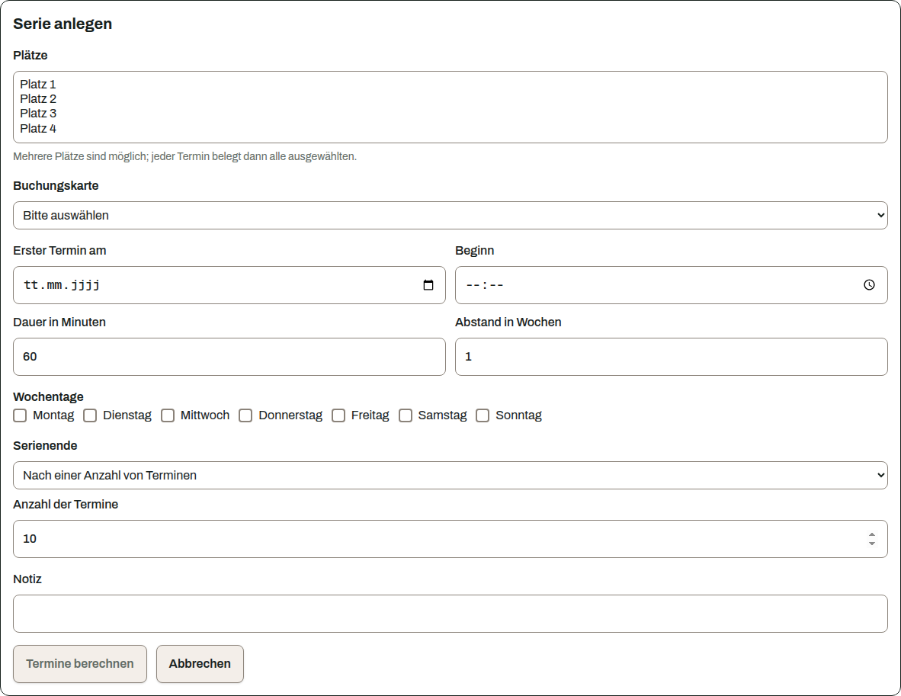

## Wenn sich unter deiner Buchung etwas ändert

Eine spätere Änderung kann deine Buchung betreffen. Beispiele sind ein deaktivierter Platz, eine
stillgelegte Buchungsart oder verkürzte Öffnungszeiten.

Courtside sendet dir eine E-Mail mit dem Grund. Die Buchung wird dadurch nicht automatisch
storniert. Der Verein entscheidet, wie er mit ihr umgeht.

## Benachrichtigungen

Öffne *Benachrichtigungen*, um optionale Nachrichten ein- oder auszuschalten.

Du kannst diese Nachrichten abwählen:

* Buchungsbestätigung,
* Erinnerung vor der Buchung,
* Nachricht über den Austritt einer Person aus deiner Buchung.

Diese Nachrichten sendet Courtside immer:

* Zugangsdaten für ein neues oder zurückgesetztes Konto,
* Mitteilung über deine Eintragung als Mitspieler,
* Mitteilung über eine Änderung, die deine Buchung betrifft.

Speichere die Auswahl. Die Einstellung gilt nur für künftige Nachrichten.

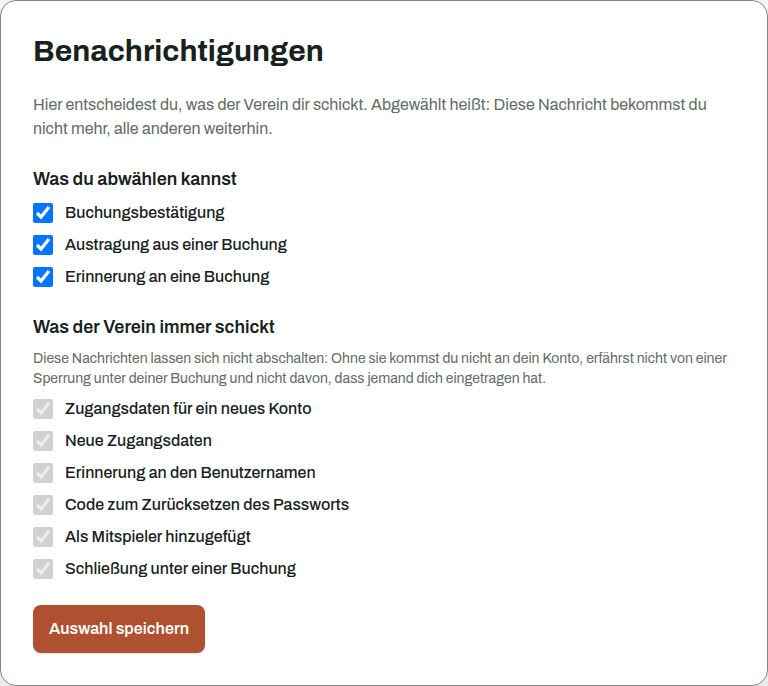

## Dein Konto

Öffne *Kontosicherheit*, um dein Passwort und deine Sitzungen zu verwalten.

Beim Ändern des Passworts musst du das aktuelle Passwort eingeben. Nach dem Speichern beendet
Courtside alle Sitzungen, auch die gerade verwendete. Melde dich danach mit dem neuen Passwort an.

Du kannst außerdem eine einzelne Sitzung oder alle Sitzungen beenden. Bei älteren Anmeldungen fragt
Courtside vor dem Beenden anderer Sitzungen erneut nach deinem Passwort. Die aktuelle Sitzung
kannst du ohne diese Rückfrage beenden.

Fehler in deinem Namen oder Benutzernamen korrigiert der Vorstand in der Personenverwaltung.

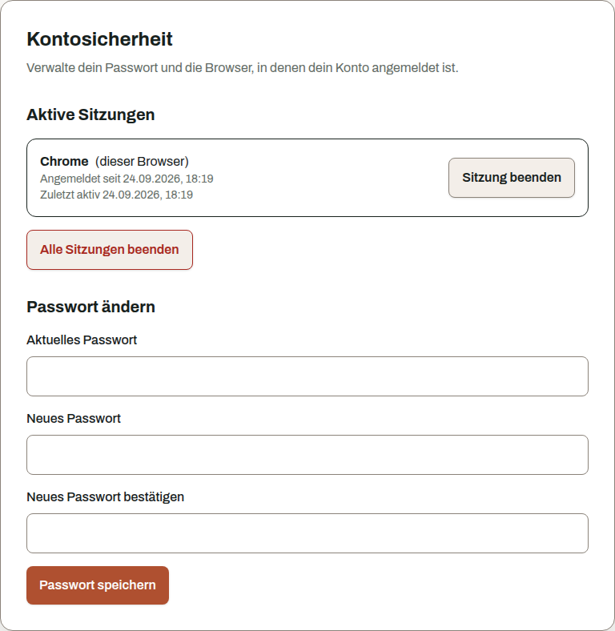
